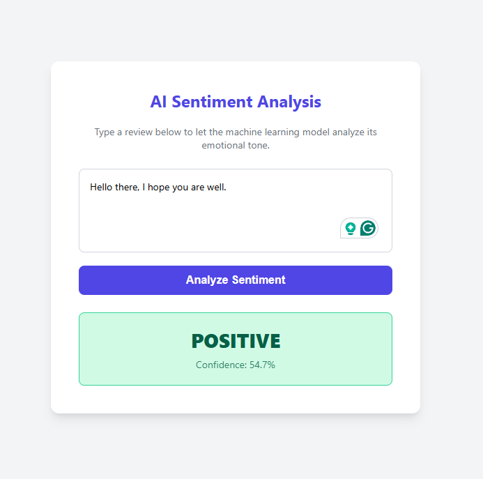
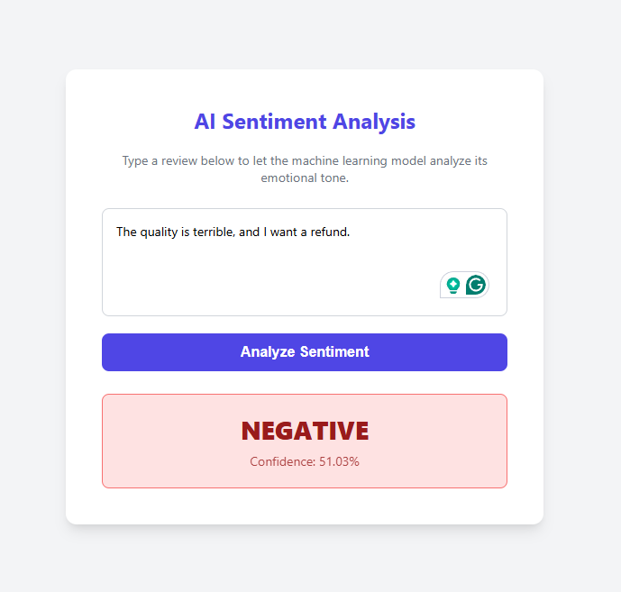

# Django ML Sentiment Analyzer

An end-to-end Machine Learning web application built with Django and Scikit-Learn. This project provides a sleek, modern UI where users can input text and receive real-time sentiment analysis (Positive/Negative) along with a model confidence score.

## 🚀 Features

* **Machine Learning Pipeline:** Utilizes a custom-trained `LogisticRegression` model with `CountVectorizer` for natural language processing.
* **Django MVT Architecture:** Fully functional backend routing using Django's Model-View-Template pattern.
* **RESTful API:** Includes an asynchronous JSON API endpoint (`/api/predict/`) for serving model inferences.
* **Dynamic Frontend:** A responsive, vanilla JavaScript and CSS user interface that dynamically changes colors based on the sentiment output—without reloading the page.

## 📸 Screenshots

### Positive Sentiment Detection
*(Replace the path below with the actual path to your positive screenshot, e.g., `images/positive.png`)*



### Negative Sentiment Detection
*(Replace the path below with the actual path to your negative screenshot)*



## 🛠️ Tech Stack

* **Backend:** Python, Django
* **Machine Learning:** Scikit-Learn, Joblib, NumPy
* **Frontend:** HTML5, CSS3, Vanilla JavaScript (Fetch API)

## 💻 Installation & Local Setup

If you want to run this project locally, follow these steps:

**1. Clone the repository**
```bash
git clone [https://github.com/mdsadikujjaman/AI-Sentiment-Analysis.git](https://github.com/mdsadikujjaman/AI-Sentiment-Analysis)
cd AI-Sentiment-Analysis
```

**2. Create and activate a virtual environment**
```bash
# Windows
python -m venv venv
venv\Scripts\activate

# macOS/Linux
python3 -m venv venv
source venv/bin/activate
```

**3. Install dependencies**
```bash
pip install django scikit-learn joblib
```

**4. Train and save the ML model**
Before running the server, you must train the local model so it can be saved to the directory.
```bash
python train_model.py
Note: This will generate a saved_model.joblib file inside the ml_model directory.
```

**5. Start the development server**
```bash
python manage.py runserver
```
